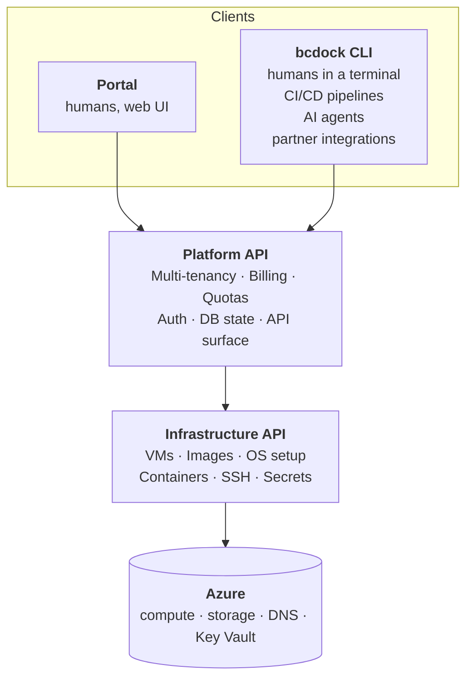

# Architecture overview

BCDock is a three-tier system. Knowing where the boundaries fall makes the rest of these pages - and a fair bit of the CLI behaviour - easier to reason about.

## The three tiers

### Platform API

Owns:

- **Multi-tenancy** - companies, memberships, company-scoped query isolation
- **Billing** - subscriptions, usage records, dual-rate metering
- **Quotas** - per-tier env counts, trial caps, suspension
- **Auth** - OTP exchange, JWTs, API keys with scopes
- **DB state** - managed relational database; background-job processing for long-running work
- **API surface** - what the CLI, portal, and integrations call

The Platform never touches Azure directly. Anything that requires creating or destroying infrastructure routes through the Infrastructure API.

### Infrastructure API

Owns the *how*:

- **VM provisioning and lifecycle** (pools)
- **VM image cache** - prepared images cached per region for fast pool creation
- **OS setup on pool VMs** - Windows + container runtime
- **Container lifecycle** on the pool VM
- **SSH operations** for setup and debugging
- **Secret management** - fetching from Key Vault, never logging

The Platform calls the Infrastructure API over HTTP; the Infrastructure API streams progress back as NDJSON. The platform side owns the *why* (which env to create for which company); the infrastructure side owns the *how* (the Docker container lifecycle and the VMs they run on).

### Clients

Two first-class clients of the Platform API, both consuming the same surface:

- **Portal** (`app.bcdock.io`) - Next.js + React web application. The path for humans who want to point and click.
- **CLI** (`bcdock`) - single static Go binary. The path for everyone who wants to script, automate, or hand the keys to an agent: humans in a terminal, CI/CD pipelines, AI agents, and partner integrations all drive the same verbs.

The CLI is deliberately the universal agent interface. A binary with `--output json`, deterministic exit codes, and `--wait` works with any AI framework, any CI system, and any shell - no per-client SDK to write or maintain. Raw HTTPS + JSON against the Platform API is supported for anyone who needs it, but the CLI is the recommended surface and the one this documentation is organised around.

There is no second, privileged API. Every action - including staff operations - goes through the same Platform API with appropriately scoped tokens; the API is the single auditable surface.

## Service boundaries

The boundary between the Platform API and the Infrastructure API is **load-bearing for the architecture**. It enforces three things:

1. **Cloud agnosticism in the Platform.** The Platform API doesn't import any Azure SDK packages. If we ever needed to support a non-Azure substrate, only the Infrastructure API would change.
2. **Auditability.** Provisioning operations stream structured progress back as NDJSON; every line gets stamped with the env or pool ID and persisted into the platform's audit trail.
3. **Secret containment.** Azure storage credentials and Key Vault tokens never leave the Infrastructure API. The Platform requests "create a SAS for blob X" or "fetch secret Y"; the Infrastructure API returns the result.

## Pool layer

A **pool** is an Azure VM hosting 2-9 BC environments. We never stop pools - they always have a public FQDN, Traefik fronting them, and capacity for new environments. The autoscaler creates pools when capacity is tight and tears them down when they're idle.

Each pool runs:

- **A reverse proxy** (Traefik) - terminates HTTPS and routes each request to the right BC container.
- **N BC containers** - one per environment, each with its own database, admin password, and DNS subdomain.

Detail lives in [images and pools](images-and-pools.md) and [URL shape](url-shape.md).

## Storage layer

Three storage classes:

- **Managed relational database** (Azure-hosted) - all platform state: users, companies, environments, usage records, audit log, provisioning logs.
- **Azure Blob Storage** (per region) - hibernation backup snapshots, data export ZIPs. 7-day soft-delete on hibernation backups.
- **Azure Key Vault** (core + per region) - TLS cert in core; per-env passwords and pool SSH keys in regional KVs.

Why per-region storage: hibernation backups are large and region-bound (you don't want to hibernate from US-West-2 and resume from `australiaeast`). Data export blobs are short-lived (24h SAS).

## Cross-cutting

- **Provisioning logs** - every long-running operation streams structured progress as NDJSON. The Platform persists every line into a per-env / per-pool audit trail you can stream via `bcdock env logs`.
- **OpenTelemetry** - exported to Azure Monitor (Application Insights). One trace per request, spans across the C#/Go boundary via baggage.
- **DNS and HTTPS** - every env gets its own subdomain under `bcdock.io` and is reachable over HTTPS. TLS is platform-managed.

## What this means for you

You don't operate any of this. From your seat:

- Every environment has a stable HTTPS URL you can bookmark, hand to a client, or paste into VS Code.
- You can hibernate when you're not using it; resume picks up exactly where you left off - same URL, same data.
- Cross-region moves and version upgrades happen behind the scenes; the URL doesn't change.
- The CLI, portal, and API all talk to the same Platform API. What you can do in one, you can do in any.

## Where to read more

- [Images and pools](images-and-pools.md) - VM image cache + pool model + autoscaler
- [URL shape](url-shape.md) - per-env URLs, BC endpoints, mapping to VS Code `launch.json`
- [Hibernation](hibernation.md) - active vs stored states, the dual-rate billing model
- [Anonymisation](anonymisation.md) - anonymise-in-place for GDPR / APP, why and how
