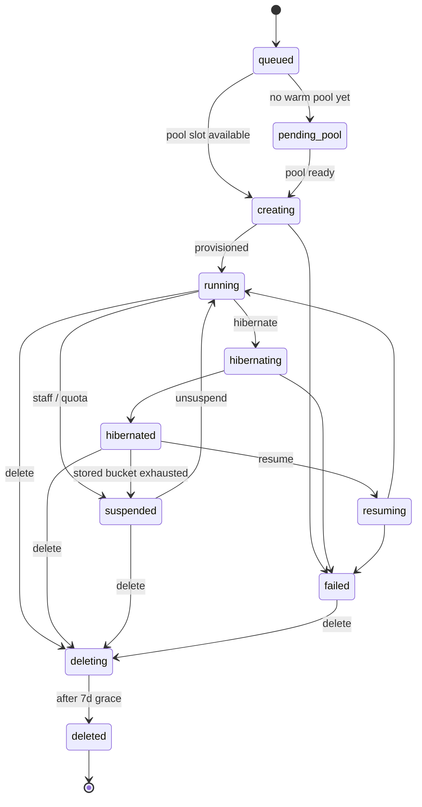

# Environment states

An environment moves through a small set of well-defined states. Knowing them lets you write robust agent loops, design CI workflows that don't race, and reason about your bill.

## The state machine



## State descriptions

| State | What it means | Active billing? | Stored billing? |
|---|---|---|---|
| `queued` | Create request accepted, waiting for pool capacity | no | no |
| `pending-pool` | Waiting for the autoscaler to provision a pool with the right BC version × country × region | no | no |
| `creating` | Pool allocated; container building | no | no |
| `running` | BC is up; URL responds | **yes** (per-second active rate) | no |
| `hibernating` | Snapshotting container to blob storage | yes (until snapshot complete) | no |
| `hibernated` | Stored as gzipped blob; pool slot freed | no | **yes** (metered stored rate) |
| `resuming` | Restoring container onto a pool (possibly different pool from hibernate) | no | yes (until container is up) |
| `suspended` | Running stopped — quota exhausted, staff action, or stored cap hit | no | yes (if was hibernated) |
| `failed` | Terminal error during create / hibernate / resume / publish | no | depends on what state it failed from |
| `deleting` | Cleaning up container, blobs, DNS records, env-record row | no | no |
| `deleted` | Gone (after 7d operator-recovery grace; row remains in DB with `deleted_at` set) | no | no |

A few additional transient values may appear briefly during provisioning (`pending-image`, `allocating-pool`, `provisioning`, `preparing`, `starting`) - these all collapse to "still working on it" semantically, surfaced through `provisioningStage` for live progress. Treat anything other than the row labels above as a transient stage; `bcdock env wait` exits cleanly on the steady states (`running`, `failed`, `hibernated`, `suspended`, `deleted`).

### "Per-second active rate"

`running` time is metered per-second at your subscription's active rate (or the higher PAYG hourly rate, if you're on PAYG). Current rates live on the [pricing page](https://bcdock.io/pricing).

### "Stored rate"

Metered per-second, the same across every plan tier. The underlying cost of holding a BC backup blob doesn't change with the plan; a tier-dependent stored rate would just be price discrimination, which we explicitly don't do. Current rate lives on the [pricing page](https://bcdock.io/pricing).

## Transitions

### `queued → creating`

When the pool autoscaler allocates capacity. For warm pools this is sub-second; for cold pools (no running pool of the right version × country × artifact-type combo), the autoscaler may also need to provision a pool VM, which adds ~5–15 min.

### `creating → running`

BC container is up and responding on its URL. This is what `bcdock env create --wait` blocks on by default.

### `creating → failed`

Provisioning hit an unrecoverable error. `bcdock env logs <name> --provisioning` shows the stage trail. Common causes: artifact download failed (BC version was withdrawn upstream), pool out of disk, image not yet built for a new version × country combo.

### `running → hibernating → hibernated`

Triggered by `bcdock env hibernate <name>`, the portal **Hibernate** button, or a billing-cap-driven auto-hibernate (when the active bucket is exhausted on a trial plan).

The env's container state is gzipped, uploaded to the region's blob storage, and the pool slot is released. Total time: 1–3 minutes for a typical env.

### `hibernated → resuming → running`

Triggered by `bcdock env resume <name>` or the portal **Resume** button. The platform picks any compatible pool (same BC version, country, artifact-type) — possibly a different pool from the one the env hibernated from.

If the resume needs a cross-major-version upgrade (no pool exists at the original BC version), the CLI/portal returns an error with the required version — re-run with `--version <ver>` to confirm. See [resume across versions](#resume-across-versions) below.

### `running → suspended` / `hibernated → suspended`

Triggers:

- **Quota exhaustion** — trial active hours hit 7h; trial stored hours hit 100h; per-env stored cap timer expired.
- **Staff action** — BCDock staff suspended the env via support workflow (rare; usually for ToS violations).
- **Plan downgrade** — if you downgrade your subscription and you exceed the new tier's environment count, the oldest envs are auto-suspended.

Suspended environments don't bill the active rate; if hibernated, they continue to bill the stored rate. Resume once the underlying cause is resolved (usually upgrading the plan).

### `* → deleting → deleted`

Triggered by `bcdock env delete <name>` or the portal **Delete** button. The env's container is destroyed, hibernation backup blobs are scheduled for deletion, DNS records are removed.

There's a **7-day operator-recovery grace** — after `delete`, blobs are soft-deleted with a recovery window. If you accidentally deleted something important, contact us within 7 days and we can restore. After 7 days the soft-delete window expires and the data is unrecoverable.

The env-record row stays in the database with `deleted_at = <timestamp>` for audit/usage attribution. Query filters exclude deleted rows from public APIs by default.

## Resume across versions

If your env was hibernated at BC v27 but the only pool available in your region is at v28, the platform requires you to confirm a cross-major-version upgrade. The platform doesn't make this decision silently — version upgrades can break extensions and data shape.

```bash
bcdock env resume my-env
# error: cross-version resume requires confirmation
# error: env hibernated at 27.0; available pool is at 28.0
# error: re-run with --version 28 to confirm

bcdock env resume my-env --version 28 --wait
# proceeds with the upgrade
```

Cross-major-version *backwards* resume is not supported. Forwards is the documented escape hatch.

## Querying state

```bash
# Single env, full detail
bcdock env get my-env -o json | jq .status

# Wait for any of several terminal states
bcdock env wait my-env --status running --status failed --timeout 30m

# All envs in current company
bcdock env list

# Filter by state
bcdock env list --status hibernated
```

`bcdock env wait` is the right shape for scripts and agents — purpose-built to wait for state transitions, exit cleanly on timeout (exit 124), don't-loop-forever guarantee.

## Diagram

```
   ┌─────────┐       ┌──────────┐       ┌─────────┐       ┌──────────────┐
   │ queued  │──────▶│ creating │──────▶│ running │──────▶│ hibernating  │
   └─────────┘       └──────────┘       └────▲────┘       └──────┬───────┘
                          │                  │                   │
                          ▼                  │                   ▼
                      ┌────────┐         ┌────────┐         ┌──────────────┐
                      │ failed │         │resuming│◀────────│  hibernated  │
                      └────────┘         └────────┘         └──────────────┘
                                                                    │
                                                                    ▼
                                                            ┌──────────────┐
                                                            │  suspended   │
                                                            └──────────────┘

   any state ──▶ deleting ──▶ deleted
```

## Related

- [`bcdock env wait`](../cli/reference/bcdock_env_wait.md) — the canonical way to block on state transitions
- [Concepts](../cli/concepts.md) — pool vs environment vs company; active vs stored
- [Limitations](limitations.md) — provisioning times, regional availability, free trial caps
